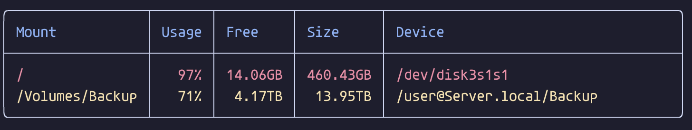

# dff

Prettifier for the `df` (diskfree) command in Go.

It highlights volumes with usage above 70% in yellow and above 90% in red.



## Installation

Using homebrew:

```bash
brew tap elentok/stuff
brew install dff
```

Using `go install`:

```bash
go install github.com/elentok/dff@latest
```

## Usage

Just run `dff` (it should be in `"$(go env GOPATH)/bin"`)

## Changelog

- **v0.1.1** - Use [lipgloss](https://github.com/charmbracelet/lipgloss) for rendering.
